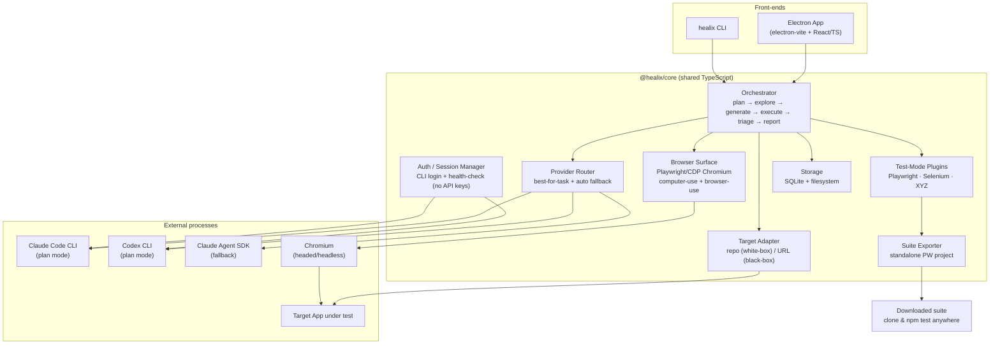
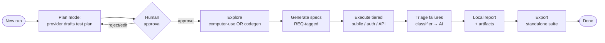
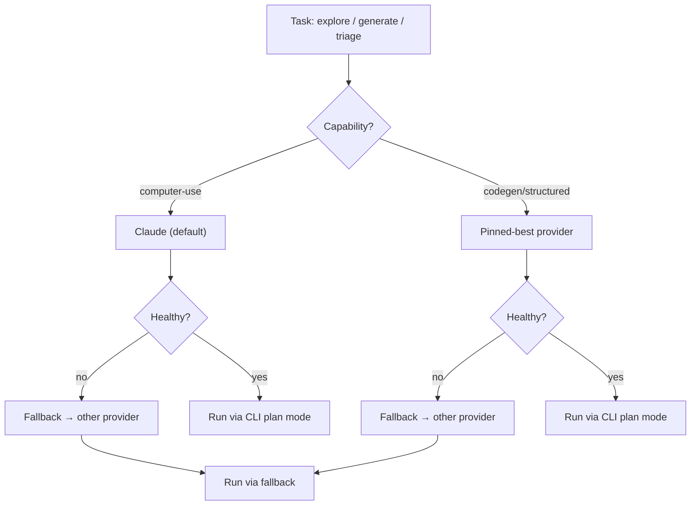
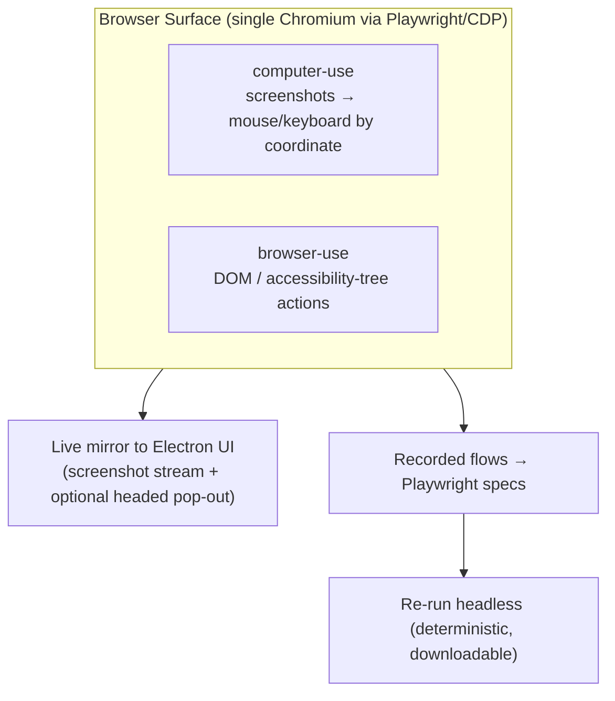

# Healix — High-Level Architecture

> Companion to [`../feature-plan.md`](../feature-plan.md). Editable diagram: [`healix-architecture.excalidraw`](./healix-architecture.excalidraw).

Healix is **local-first**. One shared core (`@healix/core`) powers two front-ends (the Electron app and the `healix` CLI). The core orchestrates AI providers through their **subscription CLIs** (plan mode) with **SDK fallback**, drives a single embedded browser for exploration, runs pluggable test engines, and persists everything to **SQLite + the local filesystem**.

---

## 1. System context

---

## 2. Run lifecycle (orchestrator state machine)

Every transition checkpoints to SQLite so a run is **resumable** (the local replacement for the old Inngest async pipeline).

---

## 3. Provider routing & fallback

- **Primary path:** provider **CLI** in plan mode → produces a plan → human gate → execution.
- **Fallback path:** Claude **Agent SDK** (subscription-backed). OpenAI has no keyless SDK, so its fallback is the **Codex CLI**.
- **Never** API keys (see [ADR-0002](../adr/0002-subscription-auth-no-api-keys.md)).

---

## 4. Browser surface (answers "do we need an embedded browser?")

**Yes — one controllable browser serves both modes.**

Discovery uses computer-use **or** browser-use (per run); the *output* is always deterministic Playwright specs that re-run without the AI. See [ADR-0006](../adr/0006-embedded-browser-surface.md).

---

## 5. Module → reference mapping

Concepts to port from `../TestBot_MCP/testbot-mcp/src`:

| Healix module | Reference source | Note |
|---|---|---|
| Target Adapter (white-box launch) | `auto-detector.js`, `multi-service-starter.js`, `port-preflight.js` | Detect port/framework/start command |
| Browser Surface | `browser-use-driver.js`, `playwright-explorer.js`, `playwright-mcp-client.js` | Collapse into one CDP surface |
| Test-Mode (Playwright) | `playwright-integration.js`, `tier-isolation.js`, `results-merger.js` | Tiered execution + blocked status |
| Credential injection | `credentials-injector.js`, `auth-flow-utils.js` | `storageState` per role |
| Generation | `webapp .../test-generation`, `prd-chunked.js`, `qa-contracts.js` | Now local, provider-driven |
| Failure triage | `failure-triage/` (`classifier.js`, `agent-response.js`, `trace-parser.js`) | Classifier → AI hypothesis |
| Report | `report-generator.js` | Local HTML/JSON instead of ingest |

---

## 6. Tech stack

| Layer | Choice |
|---|---|
| Desktop shell | Electron + electron-vite, electron-builder |
| Renderer | React + TypeScript |
| Shared core | `@healix/core` (TypeScript, framework-agnostic) |
| CLI | Node/TS (`healix`), same core |
| Storage | SQLite (`better-sqlite3`) + filesystem |
| Browser automation | Playwright (CDP) |
| AI | Claude Code CLI + Codex CLI (plan mode) · Claude Agent SDK (fallback) |
| Secrets | OS keychain (`keytar`/`safeStorage`) — no keys, only session metadata |
